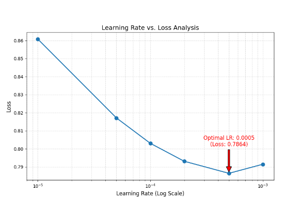

# Lab2 !!!!!Report!!!!!

# Setup
Models: Llama-3 3B, Gemma 2B, Phi-3 mini

# Superparameters Evaluation  

We also tried to change accumulate_steps when we set the Lr to 5e-4.
The results are:
Loss: 0.8109996272623539 -> accumulate_steps = 2

Loss: 0.7864152975380421 -> accumulate_steps = 4

Loss: 0.7685952693223953 -> accumulate_steps = 8

Based on the result we will use Lr=5e-4 and accumulate_steps = 8 to train our model.

# LLM Model Evaluation Comparison Report

## Executive Summary

This report presents a comprehensive evaluation and comparison of six Large Language Model (LLM) variants, analyzing their performance across multiple metrics including perplexity, inference speed, generation quality, and resource efficiency.

---

## 1. Overview

**Models Evaluated**: 6  

### Models Under Evaluation

1. **Parameters Change** - Model with modified parameters
2. **Phi-3.5-mini-instruct** - Microsoft Phi-3.5 mini instruction-tuned model
3. **Using Orca** - Model trained using Orca dataset
4. **Using Ultrachat** - Model trained using Ultrachat dataset
5. **Fully Model** - Complete baseline model
6. **Gemma** - Google's Gemma model

---

## 2. Key Performance Metrics

### 2.1 Overall Scores

| Model | Overall Score | Rank |
|-------|---------------|------|
| **Gemma** | **95** | 🥇 1st |
| Parameters Change | 85 | 🥈 2nd (tied) |
| Using Orca | 85 | 🥈 2nd (tied) |
| Using Ultrachat | 85 | 🥈 2nd (tied) |
| Fully Model | 85 | 🥈 2nd (tied) |
| Phi-3.5-mini-instruct | 80 | 🥉 6th |

**Key Finding**: Gemma significantly outperforms other models with a 10-point lead over the next tier.

---

### 2.2 Perplexity Analysis

**Lower is better** - Indicates better prediction accuracy and language understanding.

| Model | Perplexity | Performance |
|-------|------------|-------------|
| **Fully Model** | **24.84** | ✅ Best |
| Gemma | 25.26 | ✅ Excellent |
| Parameters Change | 25.41 | ✅ Excellent |
| Using Orca | 26.30 | ✅ Good |
| Using Ultrachat | 26.92 | ✅ Good |
| Phi-3.5-mini-instruct | 2100.05 | ❌ Poor |

**Critical Issue**: Phi-3.5-mini-instruct shows abnormally high perplexity (2100.05), indicating severe coherence problems - approximately 84x worse than other models.

**Analysis**: 
- The top 5 models show similar perplexity (24.84 - 26.92), indicating comparable language modeling capabilities
- Fully Model achieves the lowest perplexity despite not having the highest overall score
- Phi-3.5's extreme perplexity suggests fundamental training or configuration issues

---

### 2.3 Inference Speed

**Tokens per Second** - Higher is better for throughput.

| Model | Tokens/Second | Relative Speed |
|-------|---------------|----------------|
| **Gemma** | **67.03** | 100% (fastest) |
| Phi-3.5-mini-instruct | 65.69 | 98% |
| Using Orca | 45.97 | 69% |
| Using Ultrachat | 45.87 | 68% |
| Parameters Change | 45.20 | 67% |
| Fully Model | 44.20 | 66% |

**Insights**:
- Gemma leads in inference speed despite having fewer parameters
- Phi-3.5-mini is fast but produces low-quality outputs (high perplexity)
- The 4 middle-tier models show similar speeds (44-46 t/s)

---

### 2.4 Generation Time

**Average Generation Time per Sample** - Lower is better for user experience.

| Model | Avg Time (seconds) | Speed Rating |
|-------|-------------------|--------------|
| **Gemma** | **0.58** | ⚡ Fastest |
| Phi-3.5-mini-instruct | 1.56 | 🚀 Fast |
| Using Orca | 2.13 | ⏱️ Moderate |
| Using Ultrachat | 2.24 | ⏱️ Moderate |
| Parameters Change | 2.32 | ⏱️ Moderate |
| Fully Model | 2.32 | ⏱️ Moderate |

**Key Observation**: Gemma generates responses 4x faster than most competitors, providing significant UX advantages.

---

### 2.5 Model Size & Parameters

#### Model Size (Storage Requirements)

| Model | Size (MB) | Size (GB) | Relative Size |
|-------|-----------|-----------|---------------|
| **Gemma** | **4,986.46** | **4.87** | Smallest |
| Parameters Change | 6,127.83 | 5.98 | +23% |
| Using Orca | 6,127.83 | 5.98 | +23% |
| Using Ultrachat | 6,127.83 | 5.98 | +23% |
| Fully Model | 6,127.83 | 5.98 | +23% |
| Phi-3.5-mini-instruct | 7,288.13 | 7.12 | +46% |

#### Parameter Count

| Model | Total Parameters | Trainable Parameters |
|-------|------------------|---------------------|
| Gemma | 2.61B | 2.61B |
| Parameters Change | 3.21B | 3.21B |
| Using Orca | 3.21B | 3.21B |
| Using Ultrachat | 3.21B | 3.21B |
| Fully Model | 3.21B | 3.21B |
| Phi-3.5-mini-instruct | 3.82B | 3.82B |

**Efficiency Analysis**:
- Gemma achieves best performance with 19% fewer parameters and 23% smaller size
- Demonstrates superior architecture and training efficiency

---

# Gemma win!!!

## Appendix: Detailed Test Results

### A1. Performance Metrics Table

| Model | Perplexity | Score | Speed (t/s) | Time (s) | Size (GB) | Params (B) |
|-------|-----------|-------|-------------|----------|-----------|------------|
| Parameters Change | 25.41 | 85 | 45.20 | 2.32 | 5.98 | 3.21 |
| Phi-3.5-mini | 2100.05 | 80 | 65.69 | 1.56 | 7.12 | 3.82 |
| Using Orca | 26.30 | 85 | 45.97 | 2.13 | 5.98 | 3.21 |
| Using Ultrachat | 26.92 | 85 | 45.87 | 2.24 | 5.98 | 3.21 |
| Fully Model | 24.84 | 85 | 44.20 | 2.32 | 5.98 | 3.21 |
| Gemma | 25.26 | 95 | 67.03 | 0.58 | 4.87 | 2.61 |

---

